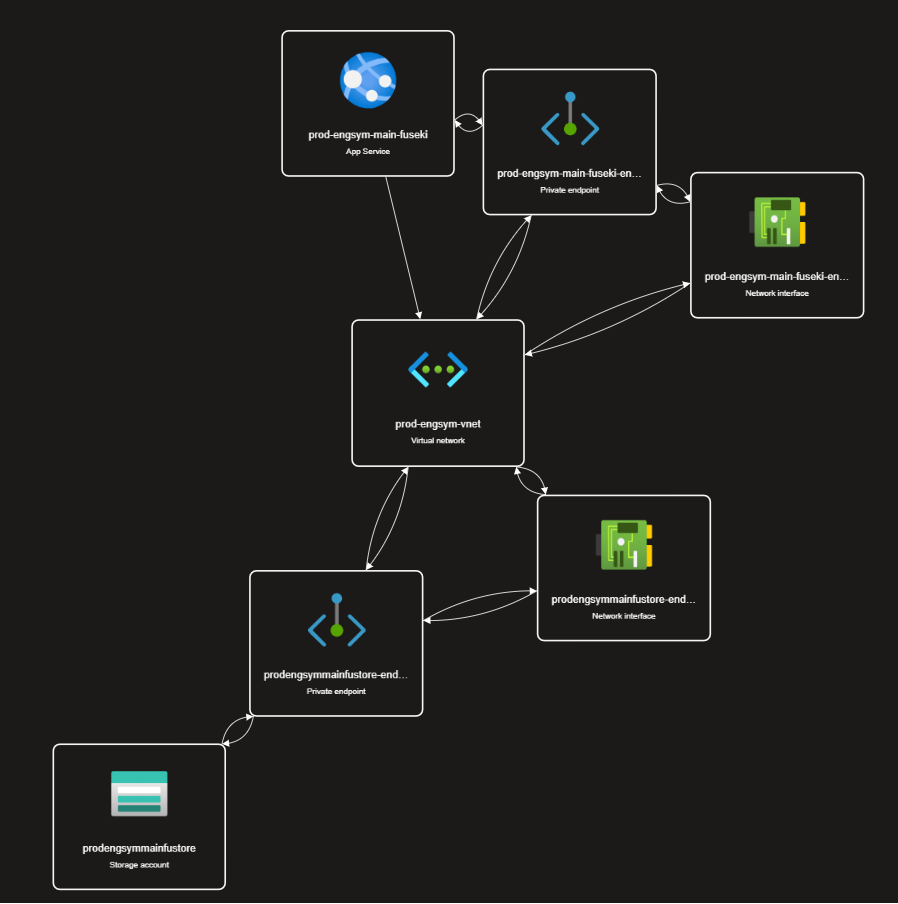

# engineering-symbols-api

## Deployments

### DEV

[dev-engsym-api.azurewebsites.net](https://dev-engsym-api.azurewebsites.net/swagger)

### Prod
[prod-engsym-api.azurewebsites.net](https://prod-engsym-api.azurewebsites.net/swagger)

## Purpose
The Enginering symbols API is intended to facilitate the creation, management and distribution of "Smart Engineering Symbols".

It is typically paired with a web frontend. A reference implementation of a web frontend can be found at [equinor/engineering-symbols](https://github.com/equinor/engineering-symbols).

The indended audience is developers or IT personel that need those features. If the intended audience is some sort of enduser or SME the correct application is the frontend reference implementation mentioned above.

## Contributing 
Create a fork, do the intended changes, publish the fork and create a pull request.

## Development, getting started

Install
- DotNet SDK for dotnet 7.
- Docker (Details depend on your specific setup)
- OR Apache Fuseki Server if you don't want to run it in a container.

### Local fuseki test db (docker)

To run a local (persistent) test database at `http://localhost:3030`, follow the instructions below. The database is persistent an located in fuseki/databases (not tracked by git).

```bash
cd fuseki

# Build fuseki docker image
chmod +x build.sh && ./build.sh

# Run fuseki as a docker container
chmod +x run.sh && ./run.sh
```

Make sure that `FusekiServers[0].DatasetUrl` in `EngineeringSymbols.Api/appsettings.Development.json` matches the settings in `run.sh`.

Prerequisites
Instructions for
Installation and setup
Build and deployment

## Features
Enables the creation, management and distribution of "Smart Engineering Symbols". 
## Architecture
The backend consists of an API (src/EngineeringsSymbols.Api), a container instance running a Fuseki Triple store, an Azure Storage Account that acts as filestorage for the tdb2 database files for the Fueski.

The Fuseki container is isolated in a virtual network, and can only be accessed via the API, the Fuseki itself has no access control enabled.

The engsym api serves a webpage frontend which indexes and presents the symbols in the database.




### Other notes
At the end of December 2023 this repository, source code and its corresponding deplpoyments will not have any active maintainers. Dugtrio, the team that did the development and intial deployments are finished in their assignment and no new maintainers have been assigned.


---
  Documentation for the engineering-symbols-api and its place in the "Symbol Editor" stack can be found in the [symbol-editor.md](https://github.com/equinor/spine-uvt-doc/blob/main/symbol-editor.md) file in the [spine-uvt-doc](https://github.com/equinor/spine-uvt-doc) repo.

