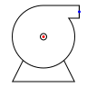
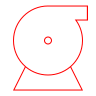

# Engineering Symbol Specification - Alpha

## Rules

1. SVG width and height
    1. Must be a multiple of 24px
    2. Minimum 24px
    3. Rectangular shape allowed
    4. 'width', 'height' and 'viewBox' attributes must be defined at root `<svg>` element
    5. 'viewBox' element must have (x1, y1) = (0, 0) and x2 and y2 must match 'width' and 'height' attributes
    6. Ex.: `<svg width="48" height="96" viewBox="0 0 48 96">`
2. Scaling
    1. The size of a symbol must be relative to other symbols in the library
    2. When designing a new symbol, keep in mind that the smallest possible element is 24x24 px
3. Drawing
    1. Only `<path ... />` elements are allowed to define symbol
    2. Path 'fill-rule' must be 'nonzero' (same as ommiting fill rule attrubute). Ex.: `<path fill-rule="nonzero" ... />`
4. Annotations
    1. Annotations must be defined in a 'g' element with id = "Annotations"
    2. Ex.: `<g id="Annotations">`
5. Connector annotations
    1. Connectors must be defined using the `<circle>` element
    2. The 'id' attribute is used to identify a connector and its 'id' and 'direction'
    3. Connector 'id' attribute is a string list with hyphen as item separator. Position `0 and 1 = annotation-connector`. `Position 2 and 3 = ID-DIRECTION`
    4. The `cx` and `cy` attributes defines the position
6. Metadata
    1. The `<metadata>` tag must include the symbol key on the format:

```xml
<metadata xmlns:es="http://rdf.equinor.com/ontology/engineering-symbol/v1#">
    <es:key>PP007A</es:key>
</metadata>
```

## Symbol Lifecycle

Workflow example:

- Create symbol file
- Upload symbol file to API
- Fetch symbol as JSON representation

### Create SVG file



```svg
<svg width="96" height="96" viewBox="0 0 96 96" fill="black" xmlns="http://www.w3.org/2000/svg">

    <metadata xmlns:es="http://rdf.equinor.com/ontology/engineering-symbol/v1#">
        <es:key>PP007A</es:key>
    </metadata>

    <g id="PP007A">
        <g id="Symbol">
            <path
                d="M52 40.5C52 42.7091 50.2091 44.5 48 44.5C45.7909 44.5 44 42.7091 44 40.5C44 38.2909 45.7909 36.5 48 36.5C50.2091 36.5 52 38.2909 52 40.5ZM51 40.5C51 38.8431 49.6569 37.5 48 37.5C46.3431 37.5 45 38.8431 45 40.5C45 42.1569 46.3431 43.5 48 43.5C49.6569 43.5 51 42.1569 51 40.5Z" />
            <path
                d="M88 20.5H76.7266C80.6809 26.1692 83 33.0638 83 40.5C83 50.9622 78.4096 60.3522 71.1329 66.7659L83 90.5H13L24.8671 66.7659C17.5904 60.3522 13 50.9622 13 40.5C13 21.17 28.67 5.5 48 5.5H88V20.5ZM48 74.5C66.7777 74.5 82 59.2777 82 40.5C82 33.0245 79.5874 26.1124 75.4984 20.5C75.2521 20.1619 74.9997 19.8285 74.7413 19.5H86.8571V6.5H49.1429V6.51885C48.7634 6.50631 48.3825 6.5 48 6.5C29.2223 6.5 14 21.7223 14 40.5C14 59.2777 29.2223 74.5 48 74.5ZM25.6501 67.4359L14.618 89.5H81.382L70.3499 67.4359C64.2874 72.4719 56.4973 75.5 48 75.5C39.5027 75.5 31.7126 72.4719 25.6501 67.4359Z" />
        </g>
        <g id="Annotations">
            <circle id="annotation-connector-1-90" cx="87.5" cy="13" r="1.5" fill="blue" />
            <circle id="annotation-connector-2-270" cx="48" cy="40.5" r="1.5" fill="red" />
        </g>
    </g>
</svg>
```

### Upload SVG file to API store

```sh
curl -X 'POST' \
  'https://dev-engsym-api.azurewebsites.net/symbols' \
  -H 'accept: */*' \
  -H 'Authorization: Bearer XXX' \
  -H 'Content-Type: multipart/form-data' \
  -F 'svgFile=@PP007A.svg;type=image/svg+xml'


201
location: 84bdc91e-707a-4fb0-b922-ff41abf57988
```

### Fetch symbol as JSON

JSON representation parsed by the Engineering Symbols API [dev-engsym-api.azurewebsites.net](https://dev-engsym-api.azurewebsites.net/swagger/index.html)

```sh
curl -X 'GET' \
  'https://dev-engsym-api.azurewebsites.net/symbols/84bdc91e-707a-4fb0-b922-ff41abf57988' \
  -H 'accept: application/json' \
  -H 'Authorization: Bearer XXX'
```

```json
{
  "id": "84bdc91e-707a-4fb0-b922-ff41abf57988",
  "key": "PP007A",
  "description": "None",
  "dateTimeCreated": "2023-05-15T09:01:01.4698184+00:00",
  "dateTimeUpdated": "0001-01-01T00:00:00+00:00",
  "geometry": "M52 40.5C52 42.7091 50.2091 44.5 48 44.5C45.7909 44.5 44 42.7091 44 40.5C44 38.2909 45.7909 36.5 48 36.5C50.2091 36.5 52 38.2909 52 40.5ZM51 40.5C51 38.8431 49.6569 37.5 48 37.5C46.3431 37.5 45 38.8431 45 40.5C45 42.1569 46.3431 43.5 48 43.5C49.6569 43.5 51 42.1569 51 40.5ZM88 20.5H76.7266C80.6809 26.1692 83 33.0638 83 40.5C83 50.9622 78.4096 60.3522 71.1329 66.7659L83 90.5H13L24.8671 66.7659C17.5904 60.3522 13 50.9622 13 40.5C13 21.17 28.67 5.5 48 5.5H88V20.5ZM48 74.5C66.7777 74.5 82 59.2777 82 40.5C82 33.0245 79.5874 26.1124 75.4984 20.5C75.2521 20.1619 74.9997 19.8285 74.7413 19.5H86.8571V6.5H49.1429V6.51885C48.7634 6.50631 48.3825 6.5 48 6.5C29.2223 6.5 14 21.7223 14 40.5C14 59.2777 29.2223 74.5 48 74.5ZM25.6501 67.4359L14.618 89.5H81.382L70.3499 67.4359C64.2874 72.4719 56.4973 75.5 48 75.5C39.5027 75.5 31.7126 72.4719 25.6501 67.4359Z",
  "width": 96,
  "height": 96,
  "connectors": [
    {
      "id": "1",
      "relativePosition": {
        "x": 87.5,
        "y": 13
      },
      "direction": 90
    },
    {
      "id": "2",
      "relativePosition": {
        "x": 48,
        "y": 40.5
      },
      "direction": 270
    }
  ]
}
```

### JSON to SVG

The JSON representation contains all information needed to reconstruct a SVG file:



```svg
<svg width="96" height="96" viewBox="0 0 96 96" fill="red" xmlns="http://www.w3.org/2000/svg">
    <path d="M52 40.5C52 42.7091 50.2091 44.5 48 44.5C45.7909 44.5 44 42.7091 44 40.5C44 38.2909 45.7909 36.5 48 36.5C50.2091 36.5 52 38.2909 52 40.5ZM51 40.5C51 38.8431 49.6569 37.5 48 37.5C46.3431 37.5 45 38.8431 45 40.5C45 42.1569 46.3431 43.5 48 43.5C49.6569 43.5 51 42.1569 51 40.5ZM88 20.5H76.7266C80.6809 26.1692 83 33.0638 83 40.5C83 50.9622 78.4096 60.3522 71.1329 66.7659L83 90.5H13L24.8671 66.7659C17.5904 60.3522 13 50.9622 13 40.5C13 21.17 28.67 5.5 48 5.5H88V20.5ZM48 74.5C66.7777 74.5 82 59.2777 82 40.5C82 33.0245 79.5874 26.1124 75.4984 20.5C75.2521 20.1619 74.9997 19.8285 74.7413 19.5H86.8571V6.5H49.1429V6.51885C48.7634 6.50631 48.3825 6.5 48 6.5C29.2223 6.5 14 21.7223 14 40.5C14 59.2777 29.2223 74.5 48 74.5ZM25.6501 67.4359L14.618 89.5H81.382L70.3499 67.4359C64.2874 72.4719 56.4973 75.5 48 75.5C39.5027 75.5 31.7126 72.4719 25.6501 67.4359Z" />
</svg>
```
